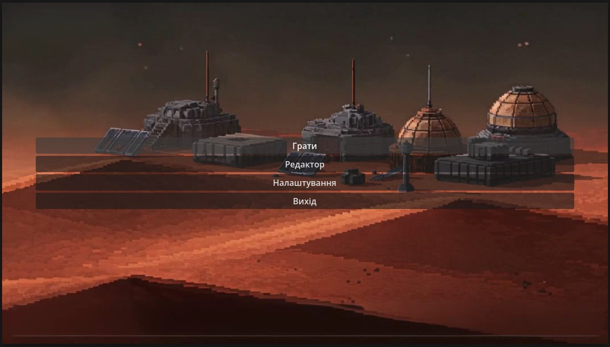
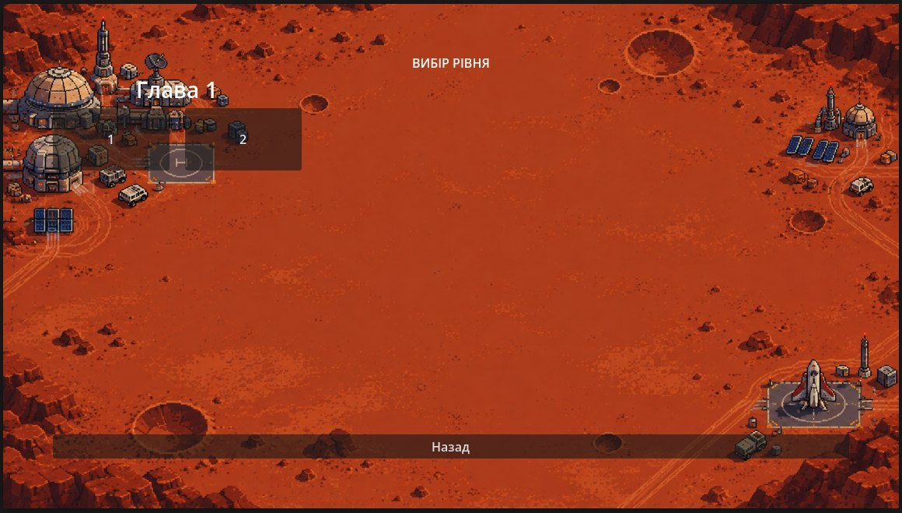
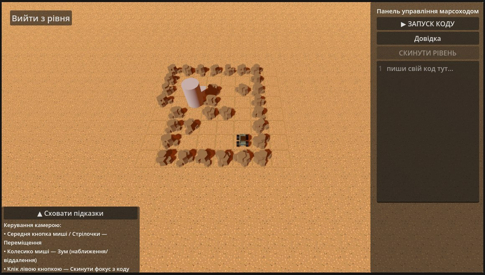
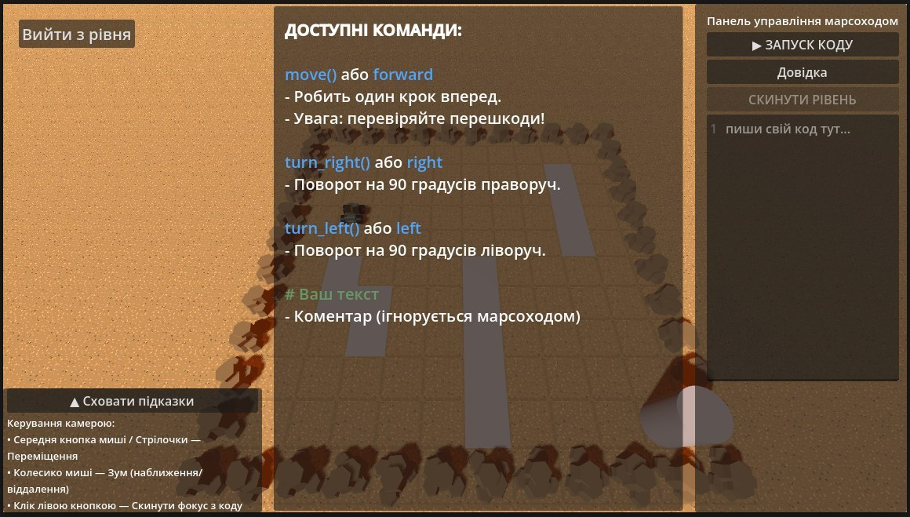

# 🚀 Марсохід — навчальна гра з програмування

Гра, у якій потрібно керувати марсоходом на поверхні Марса за допомогою простого коду. Гравець пише команди (`move`, `turn_left`, `turn_right` тощо), запускає програму і дивиться, як марсохід виконує її крок за кроком — доки не досягне фінішу, не впаде в яму або не вріжеться у камінь.

Гра створена на движку **Godot** (C#).

---

## 📋 Зміст

- [Головне меню](#-головне-меню)
- [Вибір рівня](#-вибір-рівня)
- [Ігровий процес](#-ігровий-процес)
- [Доступні команди](#-доступні-команди)
- [Керування камерою](#-керування-камерою)
- [Результати проходження рівня](#-результати-проходження-рівня)

---

## 🖥 Головне меню

При запуску гри відкривається головне меню з такими пунктами:

| Пункт | Опис |
|---|---|
| **Грати** | Переходить до екрана вибору глави та рівня. |
| **Редактор** | Відкриває інструмент для створення власних рівнів *(окремий розділ документації)*. |
| **Налаштування** | Налаштування гри. |
| **Вихід** | Закриває гру. |

---

## 🗺 Вибір рівня

Після натискання **«Грати»** відкривається карта глави. На ній розташовані станції, а рівні глави позначені пронумерованими мітками (1, 2, ...) поруч із базою.

- Натискання на номер рівня завантажує відповідну сцену з рівнем.
- Кнопка **«Назад»** внизу екрана повертає до головного меню.
- Крім офіційних глав, гра автоматично підвантажує список **власних (кастомних) рівнів**, збережених через редактор — вони відображаються окремим блоком «Створені рівні».

---

## 🎮 Ігровий процес

Рівень — це сітка з квадратних клітинок. На полі можуть бути:

- **Підлога** — клітинки, якими марсохід може проїхати;
- **Камінь** — перешкода: наїзд на камінь = аварія;
- **Яма** — провалля: заїзд у яму = аварія;
- **Точка старту** — місце появи марсохода;
- **Фініш** — ціль, до якої потрібно доїхати.

Праворуч розташована **«Панель управління марсоходом»**:

| Елемент | Призначення |
|---|---|
| **▶ ЗАПУСК КОДУ** | Запускає написану програму — марсохід почне виконувати команди по черзі. |
| **Довідка** | Відкриває/ховає панель із переліком доступних команд. |
| **СКИНУТИ РІВЕНЬ** | Повертає марсохід у стартову позицію та дозволяє редагувати код знову (активна лише після завершення запуску). |
| Поле коду | Текстовий редактор, де гравець пише свою програму — рядок за рядком, з підсвіткою синтаксису. |

Кнопка **«Вийти з рівня»** у верхньому лівому куті повертає до меню вибору рівнів.

Під час виконання коду поле редактора блокується для редагування, а кнопка запуску стає неактивною — щоб уникнути зміни коду «на льоту».

---

## 🧩 Доступні команди

Панель довідки (кнопка **«Довідка»**) показує список підтримуваних команд:

| Команда | Синонім | Що робить |
|---|---|---|
| `move()` | `forward` | Робить один крок вперед. **Увага:** перевіряйте перешкоди — камінь чи яма попереду призведуть до аварії. |
| `turn_right()` | `right` | Поворот на 90° праворуч. |
| `turn_left()` | `left` | Поворот на 90° ліворуч. |
| `# текст` | — | Коментар — рядок ігнорується марсоходом (використовується для нотаток у коді). |

Кожна команда пишеться в редакторі коду окремим рядком. Програма виконується послідовно, рядок за рядком, з невеликою затримкою між кроками — щоб було видно рух марсохода.

Якщо в коді зустрічається невідома команда, виконання зупиняється з повідомленням про синтаксичну помилку.

---

## 🎥 Керування камерою

Під час гри доступне вільне керування оглядовою камерою:

- **Стрілочки на клавіатурі** — переміщення камери по полю.
- **Середня кнопка миші (затиснути й тягнути)** — панорамування камери.
- **Колесико миші** — наближення / віддалення (зум).
- **Клік лівою кнопкою миші по порожньому місцю** — знімає фокус з поля коду (зручно, якщо стрілочки перестали рухати камеру, бо курсор «застряг» у редакторі коду).

Ці підказки завжди доступні на екрані рівня — їх можна згорнути кнопкою **«Сховати підказки»**.

---

## 🏁 Результати проходження рівня

Після завершення виконання коду можливі такі результати:

- ✅ **Успіх** — марсохід зупинився точно на клітинці фінішу. Повідомлення: *«Рівень пройдено! Ти бог C#!»*
- ❌ **Провал** — код виконався повністю, але марсохід не доїхав до фінішу.
- 💥 **Аварія (стіна)** — марсохід врізався у камінь.
- 💥 **Аварія (яма)** — марсохід заїхав у яму і впав.

У будь-якому з випадків невдачі можна натиснути **«СКИНУТИ РІВЕНЬ»**, виправити код і спробувати ще раз.

---

*Документація описує лише режим проходження рівнів. Функціонал редактора рівнів винесено в окремий документ.*
